# Oracle app Deployment and Execution in Docker container and Kubernetes Cluster.


## Description

This example demonstrates how we can deploy and run Oracle app in Docker and Kubernetes Cluster.
Oracle app need runtime oracle client libraries to execute app. We have created Docker file which install those libraries. 
The main purpose of this sample is:
a) To deploy oracle app in Docker container and execute in the same.
b) To execute already deployed app in kuburnetes cluster.

## Prerequisites

1. Ensure that docker and minikube must be install on local computer .
3. In order to deploy and run Oracle app make sure Oracle app, Docker file and deployment.yml file should be present at same location.

## Deploying and Executing Oracle app in Docker container

1. Create a folder and place your Oracle app and Docker file in it.

2. Now open terminal from this location.

3. Build oracle app using below command:
    
    `docker build -t  oracle-app .`

    Here docker reads the Dockerfile to create an image and tags it with the name oracle-app.
    Note: There is a dot (.) at the end of the command which is required as an argument.

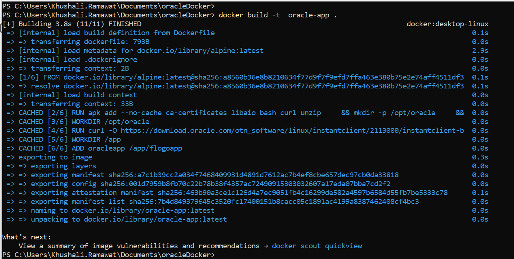

4. Check for oracle-app image is created or not using below command:
    
    `docker images`

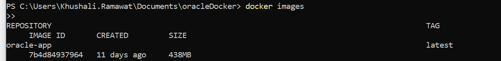

5. Run oracle-app docker image using below command:
    
    `docker run -i -t -p 9999:9999 oracle-app`

    Here above command exposes port 9999 on the host machine, forwarding it to port 9999 inside the container.

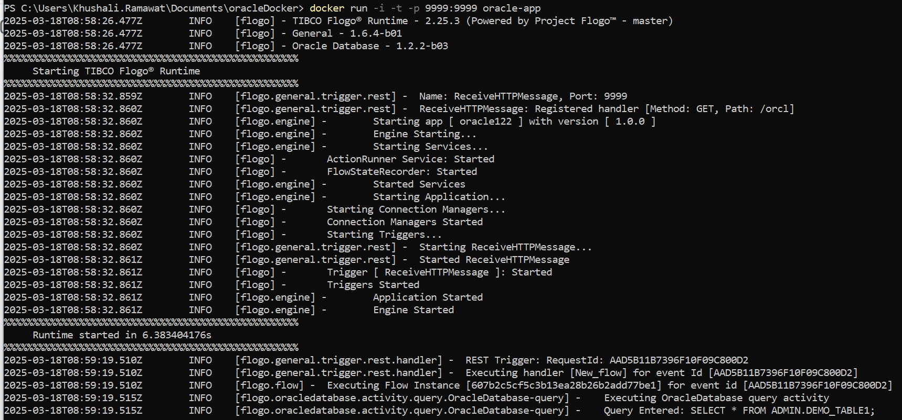

6. Hit below curl command to get output: 
    
    `curl http://localhost:9999/orcl`

    Here above command sends an HTTP request to your local machine (localhost) on port 9999, requesting the /orcl endpoint.

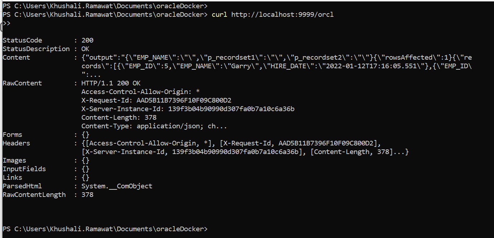

7. Check oracle-app logs using below command:
    
    `docker logs <<CONTAINER_ID>>`

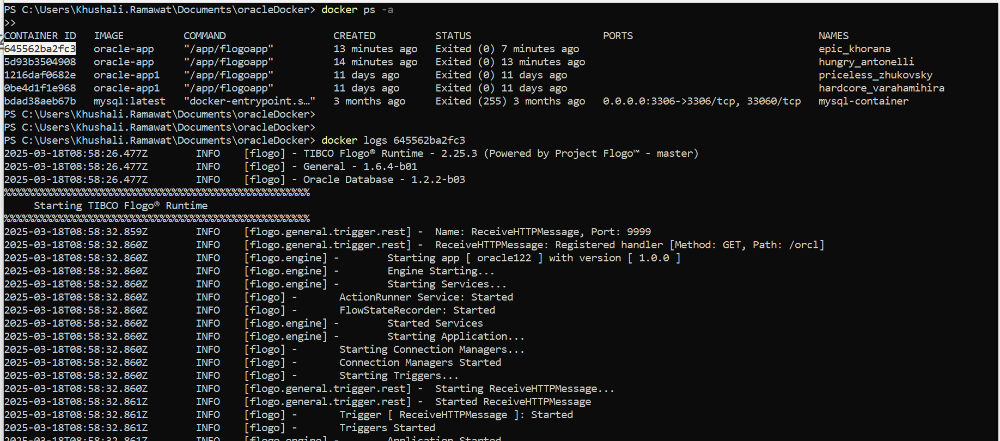

8. Check running container using below command:
    
    `docker ps -a`

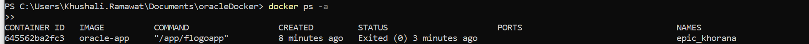
  

## Deploying and Executing Oracle app in Kubernetes Cluster

1. Use image name and tag which is get created after building above oracle app eg. oracle-app:latest and Update your deployment.yml file accordingly.

2. Load above created image into minikube using below command:
  
    `minikube image load oracle-app:latest` 

3. Check that above image is load into minikube or not using below command:
    
    `minikube image list`

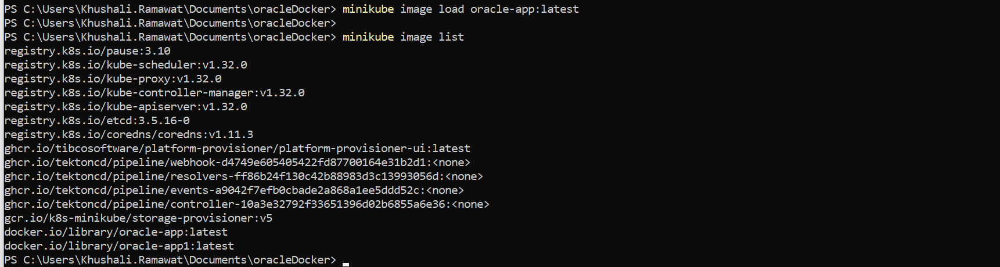

4. Apply updated deployment.yml file changes using below command:
  
    `kubectl apply -f deployment.yaml`
    Here above command tells Kubernetes to create or update resources based on the configurations defined in the deployment.yaml file.

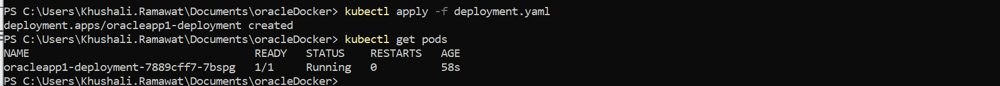

5. Check pods using below command:
    
    `kubectl get pods`

6. Check logs using below command:
    
    `kubectl logs <podname>`
    eg: kubectl logs oracleapp-deployment-7889cff7-2fsjh

7. Forward port to access your app locally on the same port using below command:
    
    `kubectl port-forward <podname> 9999:9999`
    eg: kubectl port-forward oracleapp-deployment-7889cff7-2fsjh 9999:9999

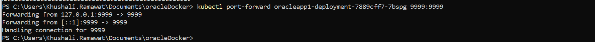

8. Hit below curl command to get output: 
    
    `curl http://localhost:9999/orcl`

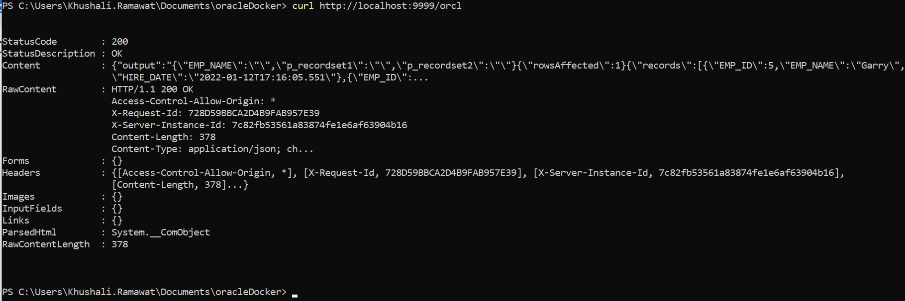  

9. Again Check logs using below command:
    
    `kubectl logs <podname>`

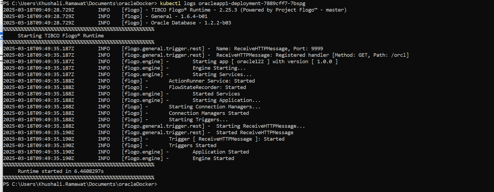

10. You ca scale down the app using below command:
    
    `kubectl scale deploy <deployment-metadata-name> --replicas=0`
    eg:kubectl scale deploy oracleapp1-deployment --replicas=0

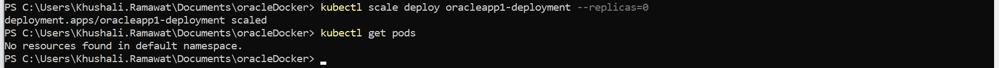


## Understanding Dockerfile and deployment.yaml file configuration

### Understanding Dokcerfile

In the Dockerfile,
1. Base Image:
    
    `FROM alpine:latest`

    This Uses Alpine Linux as the base image.

2. Install Dependencies:
    
    `RUN apk add --no-cache ca-certificates libaio bash curl unzip \ && mkdir -p /opt/oracle \ && apk add gcompat`

    This Installs necessary tools (SSL certificates, libraries, bash, curl, unzip, gcompat) to support Oracle Instant Client and the Flogo app.
    After installing these dependencies, it creates a directory /opt/oracle for Oracle files using mkdir -p /opt/oracle.

3. Download and Install Oracle Instant Client:  
    ```WORKDIR /opt/oracle```
    ```RUN curl -O https://download.oracle.com/otn_software/linux/instantclient/2113000/instantclient-basic-linux.x64-21.13.0.0.0dbru.zip \```
      ```&& unzip instantclient-basic-linux.x64-21.13.0.0.0dbru.zip \```
      ```&& rm instantclient-basic-linux.x64-21.13.0.0.0dbru.zip```
    
    It downloads and installs Oracle Instant Client into /opt/oracle.


4. Set Environment Variables:
  
    ```ENV LD_LIBRARY_PATH="/opt/oracle/instantclient_21_13" ENV PATH="/opt/oracle/instantclient_21_13:$PATH"```

    It Configures LD_LIBRARY_PATH and PATH to point to the Oracle Instant Client.

5. Set Working Directory and Add Flogo App:
    
    ```WORKDIR /app```
    ```ADD oracleapp /app/flogoapp```

    Copies the application files from the host machine to the container.

6. Set Entrypoint:
    
    `CMD ["/app/flogoapp"]`

    Defines the default command to run the Flogo application when the container starts.
 

### Understanding deployment.yaml file

1. apiVersion:
    
    `apiVersion: apps/v1`
  
    This specifies the version of the Kubernetes API you're using to create the deployment. Here it is set to apps/v1, which is standard for deployments.

2. kind:
    
    `kind: Deployment`
    
    This defines the kind of Kubernetes resource being created. In this case, it is a Deployment, which is used to manage stateless applications and ensure a specified number of replicas are running.

3. metadata:
    
    ```metadata:```
      ```name: oracleapp1-deployment```
      ```labels:```
        ```app: oracleapp1```

  Metadata provides information about the deployment:
    * name: The name of the deployment is oracleapp1-deployment.  
    * labels: This assigns a label app: oracleapp1 to the deployment, which is useful for selecting resources with the same label.

4. spec:

    ```spec:```
      ```replicas: 1  # You can change this if you want to scale```
      ```selector:```
        ```matchLabels:```
          ```app: oracleapp1```

  The spec section defines the specifications for the deployment:
    * replicas: Specifies the number of identical pods to be running. It’s set to 1, meaning only one pod will be running, but you can scale it by changing this number.
    * selector: Defines how the deployment will identify which pods to manage. In this case, it uses the label app: oracleapp1.

5. template:
  
    ```template:```
      ```metadata:```
        ```labels:```
          ```app: oracleapp1```
      ```spec:```
        ```containers:```
          ```- name: oracleapp1-container```
            ```image: docker.io/library/oracle-app1:latest  # Replace with your image```
            ```imagePullPolicy: Never```
            ```ports:```
              ```- containerPort: 9999  # Replace with your app's exposed port```
            ```env:```
              ```- name: LD_LIBRARY_PATH```
                ```value: "/opt/oracle/instantclient_21_13"```
              ```- name: PATH```
                ```value: "/opt/oracle/instantclient_21_13:$PATH"```

  The template defines the pod template for the deployment:
  * metadata.labels: This ensures that the pods created by the deployment will also have the label 'app: oracleapp1'.
  * spec.containers: Describes the container(s) that will be deployed inside the pod:
    * name: The container's name is oracleapp1-container.
    * image: Specifies the Docker image to use, here it is docker.io/library/oracle-app1:latest. This should be replaced with your actual image if different.
    * imagePullPolicy: Set to Never, which means the image will never be pulled from the registry, and Kubernetes assumes it's already available on the node.
    * ports: The container exposes port 9999, which should match the port your application listens to.
    * env: Defines environment variables for the container:
      * LD_LIBRARY_PATH: Points to the Oracle Instant Client location.
      * PATH: Appends the Oracle Instant Client path to the system’s PATH environment variable.


## Outputs

1. Application run using Docker


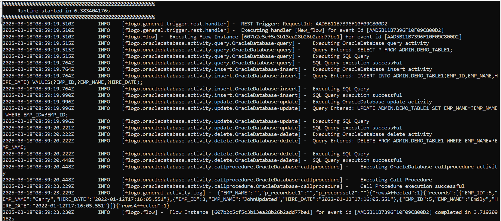

2. Application run using Kubernets


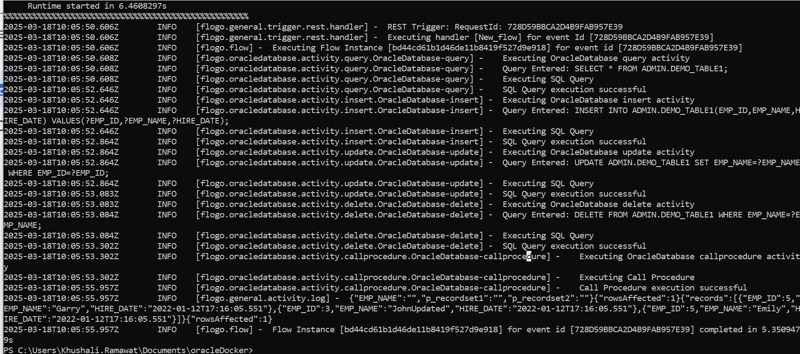

## Troubleshooting

* If you see error like: `Cannot locate a 64-bit Oracle Client library: "libclntsh.so: cannot open shared object file: No such file or directory"` then make sure that your docker file installed oracle client libraries successfully
* If you see error like: `couldn't get current server API group list: Get "https://172.24.206.179:8443/api?timeout=32s": dial tcp 172.24.206.179:8443: connectex: A connection attempt failed because the connected party did not properly respond after a period of time, or established connection failed because connected host has failed to respond.` then make sure that your Kubernetes cluster is running. If you're using a local setup (like Minikube or Docker Desktop), ensure that the Kubernetes service is started and healthy. 

## Contributing
If you want to build your own activities for Flogo please read the docs here.

If you want to showcase your project, check out [tci-awesome](https://github.com/TIBCOSoftware/tci-awesome)

You can also send an email to `tci@tibco.com`

## Feedback
If you have feedback, don't hesitate to talk to us!

* Submit feature requests on our [TCI Ideas](https://ideas.tibco.com/?project=TCI) or [FE Ideas](https://ideas.tibco.com/?project=FE) portal
* Ask questions on the [TIBCO Community](https://community.tibco.com/answers/product/344006)
* Send us a note at `tci@tibco.com`

## Help
Please visit our [TIBCO Cloud<sup>&trade;</sup> Integration documentation](https://integration.cloud.tibco.com/docs/) and TIBCO Flogo® Enterprise documentation on [docs.tibco.com](https://docs.tibco.com/) for additional information.

## License
This TCI Flogo SDK and Samples project is licensed under a BSD-type license. See [license.txt](license.txt).

